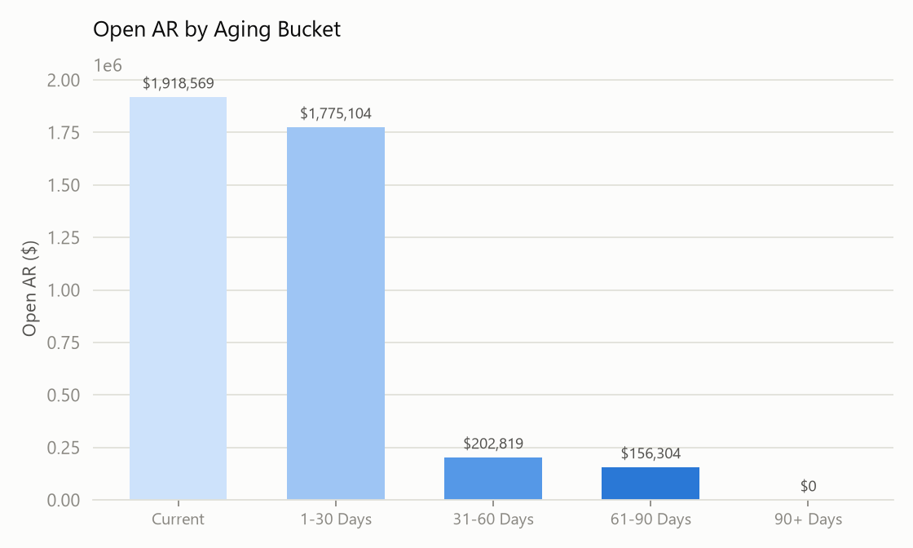
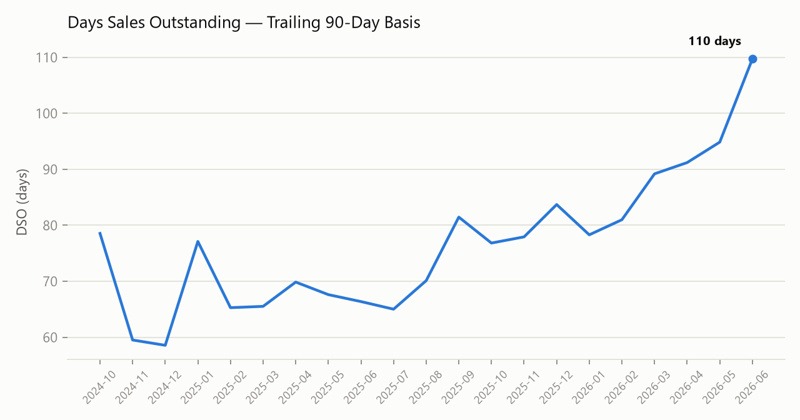
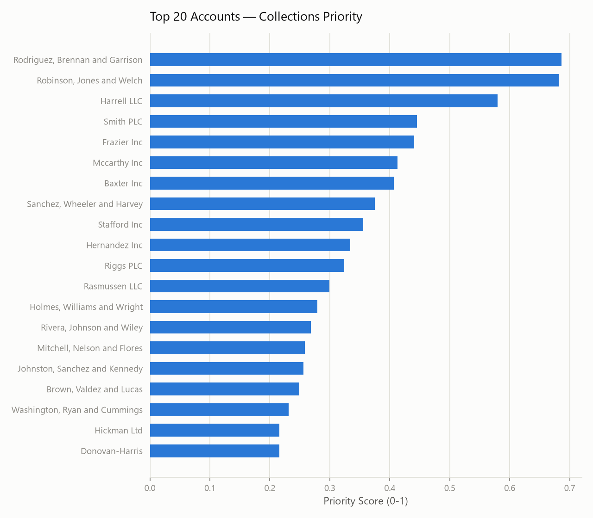

# AR Aging & Collections Prioritizer

A synthetic order-to-cash dataset and a scoring model for the everyday
collections question: **out of everyone who owes you money, who do you
call first?**

> **This dataset is 100% synthetic.** Customer names are Faker-generated,
> amounts/dates/payment behavior are randomly simulated — nothing here
> represents any real company, customer, or employer data.

## The business question

DSO and an aging schedule tell you *how much* is overdue. They don't tell
you *where to spend your limited collections time today*. This project
builds a simple, transparent priority score that combines:

- **Dollar exposure** — bigger balances matter more, all else equal
- **How overdue** — the longer past due, the higher the risk of write-off
- **Payment history** — customers who have historically paid late are more
  likely to need a nudge again
- **Dispute/write-off risk** — customers with a track record of disputes or
  write-offs get a bump, since a "clean-looking" open balance can hide risk

## Data

`scripts/01_generate_synthetic_data.py` generates 160 synthetic customer
accounts across Enterprise/Mid-Market/SMB segments and ~2,000 invoices over
~21 months, with each customer assigned a hidden "payment discipline"
parameter that drives realistic-looking (but entirely fake) late-payment,
dispute, and write-off patterns — then that hidden parameter is dropped
before the data is "published," the same way you wouldn't have a customer's
future payment behavior in a real AR system.

## Findings (on the synthetic dataset)

### Open AR is concentrated in the newest buckets — as expected — but ~$360K is 31+ days past due



### DSO has been trending up



Trailing-90-day DSO climbs from the high-50s/60s (late 2024) toward ~110
days by mid-2026 in this simulation — worth flagging as the kind of trend
that should trigger a proactive collections push, not just a monthly
report.

### The priority score surfaces a short, actionable worklist



The full ranked worklist is in
[`data/collections_priority_worklist.csv`](data/collections_priority_worklist.csv) —
every account with an open balance, ranked, with the four component scores
broken out so the ranking is auditable rather than a black box.

## Priority score, in full

```
priority_score = 0.40 × normalized(open_amount)
               + 0.35 × normalized(max_days_past_due)
               + 0.15 × normalized(avg_days_late_historical)
               + 0.10 × normalized(dispute_writeoff_rate)
```

Weights are a starting point, not a claim of optimality — in a real
setting they'd be tuned against actual recovery outcomes (did chasing
high-score accounts first actually improve recovery rate / reduce
write-offs, holding effort constant).

## Reproducing this analysis

```bash
pip install pandas numpy matplotlib faker

cd scripts
python 01_generate_synthetic_data.py
python 02_analysis.py
```

Outputs land in `data/` (aggregated + worklist CSVs) and `figures/`.

## Why this is here

This is the finance-side counterpart to
[**A Prioritization Model for Voter Outreach**](../voter-outreach-prioritization/) —
same scoring logic (dollar/impact × urgency × history × risk), pointed at a
completely different problem. The parallel is the point.
