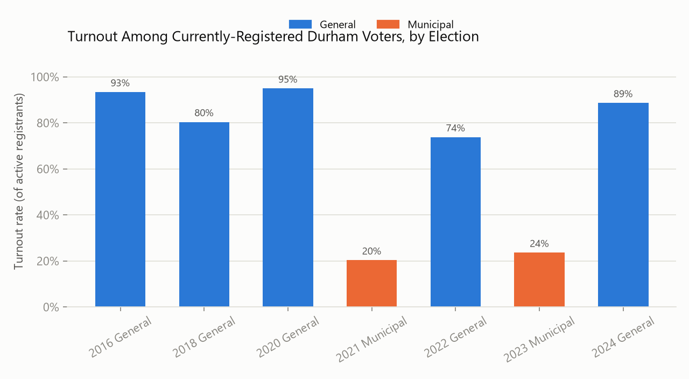
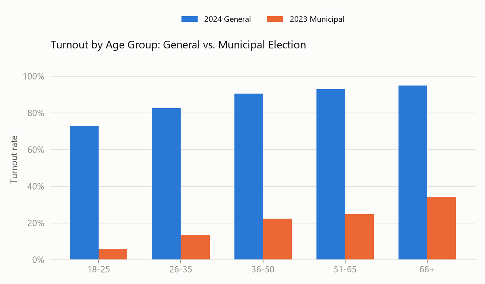
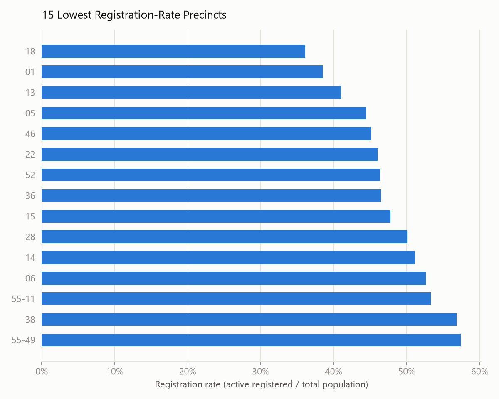
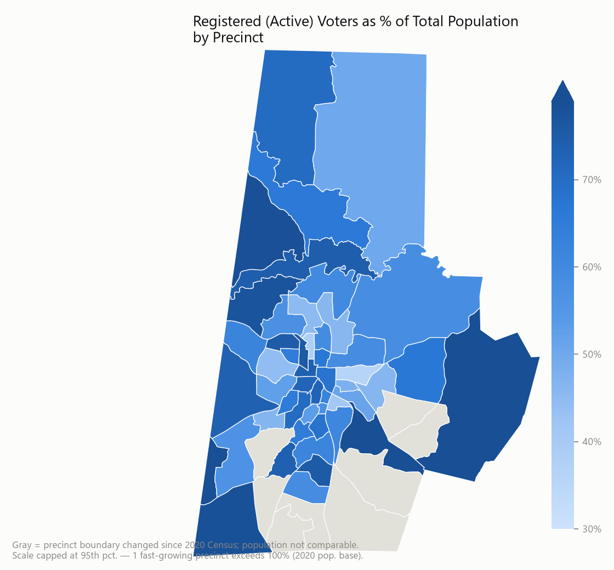
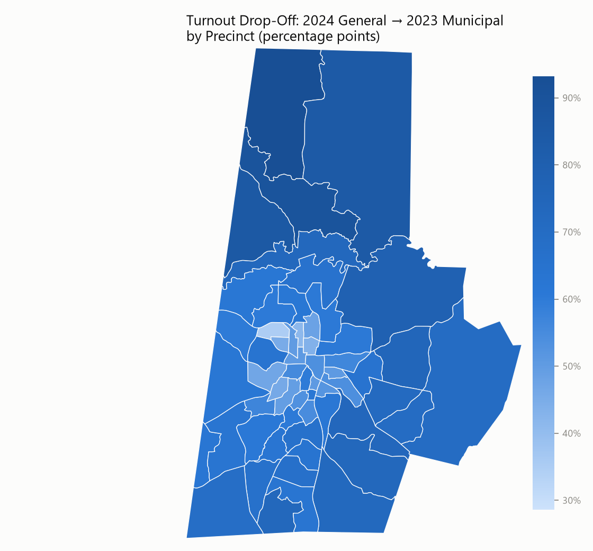

# Durham County Voter Registration & Turnout Analysis

**The question:** where does registration and turnout actually lag in Durham
County, N.C. — and for whom? Not "is turnout low" in the abstract, but which
precincts and which age groups a registration/turnout campaign should
prioritize first, and how much room for improvement realistically exists.

This is public-data-only analysis — no non-public Bull City Votes data is
used or included here.

## Data sources (all public)

| Source | What it gives us | Link |
|---|---|---|
| NC State Board of Elections — Voter Registration Data | Individual-level registration records (status, precinct, party, race, age, registration date) | [ncsbe.gov/results-data/voter-registration-data](https://www.ncsbe.gov/results-data/voter-registration-data) |
| NC State Board of Elections — Voter History | Individual-level record of which elections each voter (by NCID) participated in, and how | same page |
| NC SBE — Precinct boundary shapefile | Current precinct geography, for mapping | ncsbe.gov GIS downloads |
| U.S. Census Bureau — 2020 PL 94-171 Redistricting Data | Total population by county and by voting district (VTD/precinct) | NC General Assembly redistricting data reports |

The registration and history files are statewide (NC has ~9M registration
records); this project filters to Durham County only and drops all direct
identifiers (name, address, phone) before any analysis — see
`scripts/02_extract_durham_subset.py`. The filtered individual-level files
live in a local, gitignored `raw/` folder and are never committed; only
the aggregated, precinct-level outputs in `data/` are.

## Methodology notes (read before trusting the numbers)

- **"Registered" = status `ACTIVE` only.** NC also carries `INACTIVE`,
  `REMOVED`, and `DENIED` records on file; those are excluded from all
  registration and turnout denominators here.
- **Turnout denominator is registration-date-aware.** For each election, the
  denominator is *currently-active registrants who were already registered
  as of that election's date* — not everyone registered today. Skipping this
  adjustment makes older elections look artificially low-turnout, since many
  of today's registrants weren't registered yet back then.
- **Registration rate uses total population, not voting-age population**,
  because that's what the PL 94-171 VTD tables provide. Treat it as a
  *relative* / comparative metric across precincts, not a literal "% of
  eligible adults registered."
- **Precinct boundaries changed since 2020.** Durham redrew ~9 of its ~59
  precincts after the 2020 Census (growth-area splits, mostly). Those
  precincts are excluded from the population-based registration-rate map
  (shown gray) because their 2020 population figure no longer corresponds to
  their current boundary — but they're still included in every turnout
  metric, which doesn't depend on Census population.
- One small, fast-growing precinct's registration count now exceeds its 2020
  population count entirely because of growth since then; the map's color
  scale is capped at the 95th percentile so one outlier doesn't wash out the
  rest of the county — see `figures/registration_rate_map.png`.

## Key findings

### 1. Municipal elections are where Durham loses most of its electorate



General election turnout among currently-registered Durham voters runs
74–95%. Municipal election turnout — the elections that pick the mayor,
city council, and school board — runs **20–24%**. That's not a small gap,
it's a different electorate. Whatever produces high general-election
turnout in Durham essentially doesn't reach municipal elections at all.

### 2. That gap is heavily concentrated in younger voters



In the 2023 municipal election, 18–25-year-olds turned out at **5.8%**,
versus **72.6%** in the 2024 general — a >12x drop-off. Every age group
drops off for municipal elections, but the drop shrinks steadily with age
(66+ goes from 95.0% to 34.3%, "only" a ~2.8x drop). **Age, not just
precinct, is a primary axis for targeting municipal-election outreach.**

### 3. Registration rate varies more than 3x across precincts




The lowest-registration precincts (36–48% of total population) cluster in
and around central/east Durham; several of the highest-registration
precincts are in stable, low-turnover suburban areas. This is the
clearest lever for base-building (registration) as opposed to
turnout-day GOTV.

### 4. Turnout drop-off (general → municipal) also varies by precinct



Not every precinct loses the same share of its electorate between a
general and a municipal election — some precincts hold onto a much larger
share of their general-election voters for municipal races than others.
Combined with finding #3, this is exactly the kind of gap-plus-feasibility
signal a prioritization model can rank on — see the companion project,
[**A Prioritization Model for Voter Outreach**](../voter-outreach-prioritization/).

## Reproducing this analysis

Requires the raw public downloads (not included in this repo — download
fresh from the links above) placed in a local folder, e.g. `~/Downloads`:
`ncvoter_Statewide.zip`, `ncvhis_Statewide.zip`, an NC SBE precinct
shapefile zip, and the three PL 94-171 population PDFs.

```bash
pip install pandas numpy matplotlib pyshp shapely pypdf

cd scripts
python 01_extract_census_population.py --downloads "<path to downloads>"
python 02_extract_durham_subset.py --downloads "<path to downloads>"
python 03_extract_durham_precincts.py --downloads "<path to downloads>"
python 04_analysis.py
```

Outputs land in `data/` (aggregated CSVs, safe to share) and `figures/`
(PNGs used above).

## What's next

- Bring in early-voting-site locations / hours to test whether *physical
  access* (distance, hours) explains any of the precinct-level variation
  above, independent of demographics.
- Extend the age-group breakdown to primaries, where turnout is lower still
  across the board.
- Statewide comparison: are Durham's patterns typical for an NC urban
  county, or distinctive?
