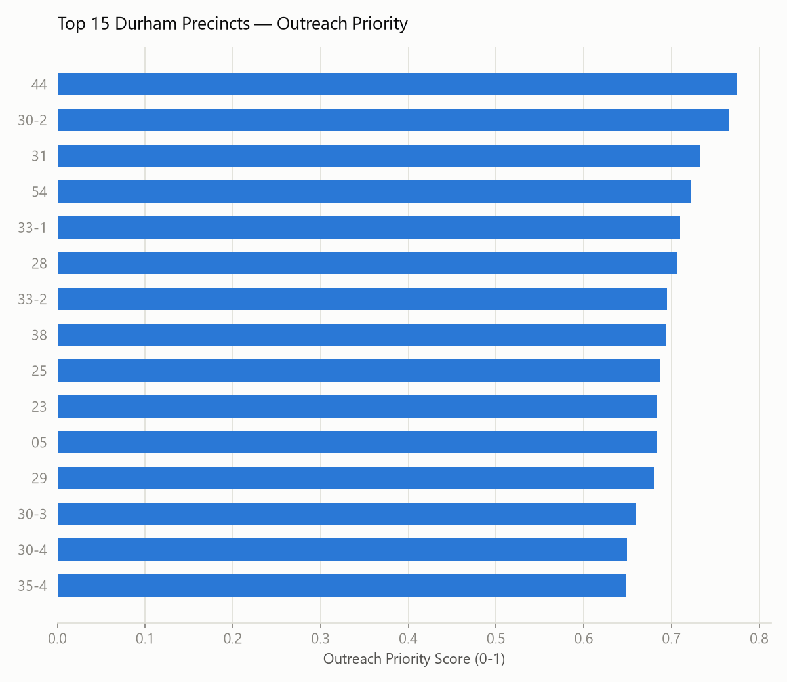

# A Prioritization Model for Voter Outreach

**The idea:** the same scoring logic that answers *"which overdue accounts
do we chase first?"* in order-to-cash collections also answers *"which
precincts does a registration/turnout campaign prioritize first?"* — score
by scale, urgency, historical pattern, and risk; rank; work the list from
the top.

This project applies that exact structure to the findings from
[**Durham County Voter Registration & Turnout Analysis**](../durham-voter-turnout-analysis/),
using the same weight shape as
[**AR Aging & Collections Prioritizer**](../ar-collections-prioritizer/):

| | O2C collections | Voter outreach | Weight |
|---|---|---|---|
| **Scale / impact** | Open dollar balance | Registered voters in precinct | 0.35 |
| **Urgency** | Days past due | General → municipal turnout drop-off | 0.35 |
| **Historical pattern** | Avg. days late, historically | Registration-rate gap (1 − registration rate) | 0.20 |
| **Risk** | Dispute/write-off rate | Absolute municipal-turnout weakness | 0.10 |

Same shape, deliberately: dollar exposure and lateness dominate a
collections score because they're the most reliable near-term signal;
precinct size and turnout drop-off dominate here for the same reason —
they're the most reliable near-term signal that outreach effort will move
real numbers, with registration gap and raw municipal weakness as
secondary tiebreakers.

## Result



Full ranked list (all 59 precincts, every component score broken out) is in
[`data/precinct_outreach_priority.csv`](data/precinct_outreach_priority.csv).

The top of the list is dominated by large, growing precincts with a wide
general-vs-municipal turnout gap (frequently 65-90 percentage points) — not
necessarily the precincts with the *worst* registration rate. That's the
scoring weights doing their job: a precinct that's already well-registered
but loses 80%+ of its general-election voters for municipal races is a
higher-leverage outreach target than a smaller, under-registered precinct
where the total number of gettable voters is lower. Five of the top 15
(marked `registration_gap_imputed = True` in the CSV) are precincts whose
boundaries changed since the 2020 Census, so their registration-gap
component is imputed at the countywide median rather than measured — worth
a manual look before treating those five as confirmed priorities.

## Where this model is weakest — and how to strengthen it

This is a first-pass, transparent scoring model, not a validated one. Two
honest gaps:

1. **No feasibility/cost term.** A real outreach plan would weight precincts
   by how reachable they are (canvassing cost, volunteer coverage, contact
   info quality) — this model only scores *opportunity*, not *cost to
   capture it*.
2. **No outcome validation.** The O2C version of this model can eventually
   be validated against actual recovery rates. This version would need a
   pilot — run outreach against the top-N precincts for one cycle, measure
   whether registration/turnout moved more than in a comparable control
   group — before trusting the ranking as more than a reasonable starting
   hypothesis.

## Reproducing this analysis

Requires `data/durham_precinct_summary.csv` from the
`durham-voter-turnout-analysis` project to already exist (run that
project's pipeline first).

```bash
pip install pandas numpy matplotlib
cd scripts
python 01_prioritize.py
```
